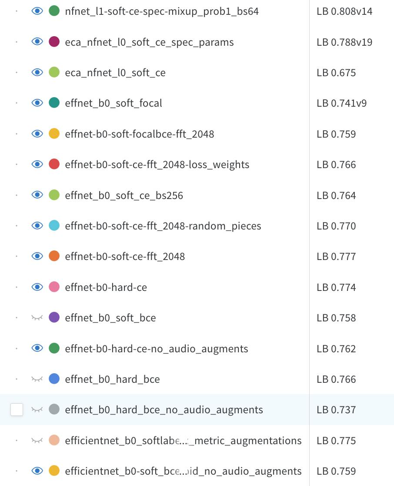

# BirdCLEF 2025 - Kaggle Competition  

This repository contains our experimental framework for the **BirdCLEF 2025** Kaggle competition. The goal of this project was to explore various modeling strategies and audio preprocessing techniques to detect bird species from audio recordings.  

Our implementation draws inspiration from previous solutions like [VSydorskyy/BirdCLEF_2023_1st_place](https://github.com/VSydorskyy/BirdCLEF_2023_1st_place) and lecture materials from [Module 3, Lecture 1 of IASA&UCU Audio Processing Course](https://github.com/VSydorskyy/ucu_audio_processing_course/blob/main/Module_3/Lecture_1/Signal_Classification.ipynb).

---

## Solution

### Exploratory Data Analysis (EDA)
- Performed detailed metadata analysis in [eda.ipynb](https://github.com/te1ord/BirdCLEF2025/blob/main/notebooks/eda.ipynb) and [dataset_test.ipynb](https://github.com/te1ord/BirdCLEF2025/blob/main/notebooks/dataset_test.ipynb) to understand data distribution and get insights about potential validation split.

**Discovered**
- Highly imbalanced data
- RocAUC target metric with macro-averaging which weights all classes the same 
- Potential data leak having same recordings from multiple collections as well as different audio splits of one large audio from the same author
- Potential use of Rating column for samples weighting  
- Potential use of secondary labels for multilabel optimization
- Presence of [**human voices**](https://www.kaggle.com/competitions/birdclef-2025/discussion/568886) in the CSA collection (a lot of minor classes)

### Data Preprocessing
Considering previous section we used Stratified split to correctly evaluate perofrmance on minority classes  **removing near-duplicate samples** (e.g., similar recordings from different collections) to avoid potential leak.

You can see the split logic in [cv_split.ipynb](https://github.com/te1ord/BirdCLEF2025/blob/main/notebooks/cv_split.ipynb)

TODO: Explore stratified by target grouped by author split to minimize chance of leakage

### Framework
The idea behind this design lies in concept of easy iterations to test many hypothesis with robust tracking and comparison with least possible changed needed to make in source code. 

Exactly because of this was built:

- a modular training pipeline to encapsulate each functional element within its module
- configurations manager with Hydra for flexible and clean experimentation
- wandb logger which tracks resolved hydra config and model ckpt
- "mlops" pipeline for inference on kaggle 

### Modeling

Modeling for multilabel classification includes such main components as :

- custom dataset class with mixup augmentation which operated on raw audios level forming training examples and corresponding soft/hard labels
- dataloader sampler weights to sample minor classes more frequent
- custom model which extracts melspecs (on GPU) and then pass to the efficientnet backbone with linear head
- optimization using classic AdamW with lr 5e-4 and weights decay 1e-5 with cosine lr scheduler which reduced lr to minimum 1e-6

### Experimental setup

#### Evaluation

In order to robustly evaluate experiments 0 fold was manually made to include all classes. Also, which is common practice for kaggle competitions, only target RocAUC metric was tracked during experiments. 

After a few iterations it was clear that local validation does not work. Discussions exploration showed that all participants have the same problem of val RocAUC~0.99 resulting in LB score in range from 0.7 to 0.9 and hidden set is affected by huge domain shift.

Experiments proved that there is no even correlation between local validation and public lb ranging from positive to negative with different hyperparameters.

This noisiness implied to use LB as validation sumbitting checkpoints from the same epochs (10) to evaluate each experiment and looking for a right direction.

Note: Setting up other metrics which handle class imbalance like F1/PR-AUC may be helpful to estimate classifier perormance from different type of errors, yet without error analysis it want help to optimise target RocAUC which does not distinguish between different type of errors so for now it was ommited. 

#### Loss Function

The Loss function in combination with soft/hard labels were chosen as first things to experiment with.
Despite the common usage of BCE loss for multilabel classification its appropriateness was doubted by mixup addition. 

Here is two cases:

1. Hard labels
- In case of hard labels per sample like [1, 1, 0, ... ,N] BCE loss truly has more sense as its optimization tends each class probabilty to 1 in case of ground truth and to 0 in case of negative, compared to CE loss which tries to split probabilty mass between two ground truths p1 = p2 = 1/2, because of softmax requiring all probs sum up to 1 which is not correct optimization setting as we want our ground truth to have probability as higher as possbile to increase RocAUC target metric

2. Soft labels
- In case of soft labels both BCE and CE are going to the same minimum where predicted probabilities reach given soft labels distribution, yet here class-independence of BCE seems to work worse at it misses regularization constraint of summing to 1 present in CE loss. This class-competition is crucial to recognize appropriate features in a mixed audio sample becuase it pushes model towards balanced representation of features from both mixed sources.

These thoughts implies two following settings:
 1. soft_labels + softmax + CE 
 2. hard_labels + sigmoid + BCE

**Experiments results:**

**Soft labels:**
BCE: LB 0.759
CE: 0.775

**Hard labels**
BCE: LB 0.766
CE: 0.774

In general hypothesis were proved thorugh experiment, but we got unexpected CE with hard labels of 0.774. I assume it happend because of larger gradients (occured because of larger loss function scale 1 * log p + 1 * log p is larger than 0.3 * log p + 0.7 * log p) make more aggressive updates and after softmax it almost zero-out uncertain classes which results in less false positives which improved LB RocAUC score. It also tends me to thought that ensembling of model optimized with CE + hard labels with other less strict classifiers may increase robustness

To regularize optimization on minor classes two other approaches were tried except from dataloader weights:
1. Class weights 
- Class weights for best model resulted in decrease from 0.777(mentioned further) to 0.766

2. Focal loss
- Focal Loss and FocalBCE loss were tried for soft labels, yet results were poor compared to previous experiments.

**Soft labels:**
Focal: LB 0.741
FocalBCE: LB 0.759

**Hard labels:**
Focal: -
FocalBCE: -

#### Other experiments

1. Melspec params
- n_fft increased from 1024 to 2048 impacted best score obtained from CE + soft labels to LB 0.777

Note: Many discussions mentioned that MelSpec parameters can drastically imrpove score. 

2. Dataset params
- no audio augmentations resulted in worse performance despite discussions claiming opposite directions, for example on hard bce from 0.766 to 0.737 LB score
- Random piece of wave was tested (compared to centered one) with the previoud best config resulted in decrease of LB to 0.770

3. Modeling params
- Increasing batch size to 256 (from 16) resulted in worse score of LB 0.764, probably because of fewer amount of optimization steps which made optimization less stochastic. It is worth reducing learning rate and experiment with batch size / lr tradeoff more. 

### Current results

---
## Future work

1. Tune MelSpectrogram parameters (some discussions showed that it drastically improves score)
2. Experiment with mixup prob and alpha (some discussions showed that prob 1 results in better performance)
3. Experiment with another backbone - we used tf_efficientnet_b0.in1k, but many kagglers use eca_nfnet_l0 as well as different poolings and featurs from different layers
4. Experiment with batch size and learning rate tradeoff
5. Tune class weigths/sampling weights temperature / focal loss gamma
6. Implement train from checkpoint to run large-scale training on best experiments
7. Filter human voice from audios

