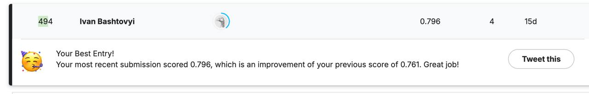

# BirdCLEF 2025 - Kaggle Competition  
Part of the UCU Audio Processing Course — Homework 3  

This repository contains our experimental framework for the **BirdCLEF 2025** Kaggle competition. The goal of this project was to explore various modeling strategies and audio preprocessing techniques to detect bird species from audio recordings.  

Our implementation draws inspiration from previous solutions, especially [VSydorskyy/BirdCLEF_2023_1st_place](https://github.com/VSydorskyy/BirdCLEF_2023_1st_place) and lecture materials from Module 3, Lecture 1.

---

## What We Did  

### Exploratory Data Analysis (EDA)
- Performed detailed metadata analysis in [eda.ipynb](https://github.com/te1ord/BirdCLEF2025/blob/main/notebooks/eda.ipynb) and [dataset_test.ipynb](https://github.com/te1ord/BirdCLEF2025/blob/main/notebooks/dataset_test.ipynb) to understand data distribution, audio duration, and sample quality.
- Discovered the presence of **human voices** in the dataset — might be worth filtering out these samples in future experiments.

### Data Preprocessing
- Created a cross-validation split while carefully **removing near-duplicate samples** (e.g., similar recordings from different collections).
- Used **StratifiedKFold** to ensure robust evaluation and balanced class representation.
You can see the slip logic in [cv_split.ipynb](https://github.com/te1ord/BirdCLEF2025/blob/main/notebooks/cv_split.ipynb)

### Model Framework
- Built a modular training pipeline from scratch.
- Managed all configurations with **Hydra** for flexible and clean experimentation.
- Developed a custom dataset class with **mixup augmentation** included.

---

## What Went Wrong  
Due to time constraints, we weren’t able to finish training our own custom model. However, we did manage to submit several **public baseline models** and gathered initial results:  

---

## Additional Resources  
We also explored several public solutions and found these resources particularly useful:
- [Insert link 1]  
- [Insert link 2]